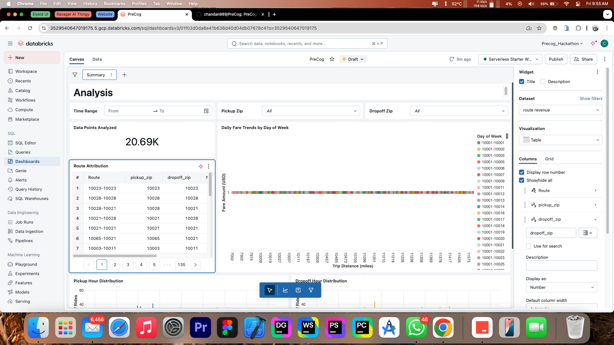

# PreCog AI (Saarthi): Illuminating Paths to Social Harmony – A Game-Changing Hyperlocal Intelligence System

**PreCog AI**, affectionately nicknamed **Saarthi (सारथी - The Charioteer/Guide)**, is a revolutionary Hyperlocal Intelligence System engineered to be a cornerstone in proactive de-escalation, social cohesion, and community well-being. In a world grappling with misinformation and complex social dynamics, particularly within diverse societies like India, PreCog AI shifts the paradigm from reactive crisis management to proactive, data-informed foresight. By harnessing the power of advanced AI, Natural Language Processing (NLP) for vernacular languages, and Big Data analytics, PreCog AI empowers local authorities, community leaders, and public service organizations with the critical insights needed to anticipate, understand, and mitigate potential social friction before it escalates.

This is not just a technology; it's a commitment to building resilient communities, fostering understanding, and ensuring efficient, empathetic governance. PreCog AI aims to be the silent guardian, the intelligent guide that helps navigate the complexities of modern societal challenges, making our communities safer and more harmonious.

## The Profound Challenge: Navigating Social Complexities in the Digital Age

India's rich tapestry of cultures, languages, and communities is a source of immense strength. However, this diversity can also present unique challenges:

*   **Localized Friction:** Misunderstandings, resource competition, or unaddressed grievances can lead to localized social friction.
*   **Misinformation & Rumors:** The rapid spread of misinformation and rumors, often amplified by social media, can quickly escalate tensions and erode trust.
*   **Reactive Governance:** Authorities often find themselves reacting to incidents after they have occurred, limiting their ability to prevent escalation and address root causes proactively.
*   **Information Overload:** Sifting through vast amounts of data from diverse sources (social media, news, public grievances) to find actionable intelligence is a monumental task.

There is an urgent need for tools that can cut through the noise, identify emerging risks with precision, and guide timely, effective interventions.

## Our Solution: PreCog AI – Your Proactive Intelligence Partner

PreCog AI offers a multi-faceted solution designed to address these challenges head-on:

1.  **Hyperlocal Sentiment & Misinformation Anomaly Detector:**
    *   Analyzes vast streams of anonymized public social media trends, local vernacular news, and crowdsourced civic reports.
    *   Utilizes advanced NLP to understand nuanced sentiment, identify emerging narratives, and detect unusual spikes in negative sentiment or the rapid spread of unverified claims (especially those with potential to cause alarm or friction).
    *   **Ethical AI Core:** Focuses strictly on *topics* of concern and the *velocity/spread* of narratives, not on individuals, ensuring privacy and preventing profiling.

2.  **Friction Point Predictor (Probabilistic):**
    *   Employs machine learning models trained on historical (anonymized, aggregated) data of social disturbances, correlated with past grievance reports, civic issue patterns, and relevant socio-economic stress indicators.
    *   Identifies geographic areas or specific conditions that might have a *higher probability* of developing social friction if underlying issues are not addressed proactively.
    *   Acts as an early *risk-flagging* system, enabling preventative resource allocation.

3.  **Intelligent Intervention Recommender:**
    *   Based on the nature and severity of detected issues (e.g., specific misinformation, type of civic grievance, inter-group misunderstanding), the AI suggests a range of proactive interventions for local authorities and community leaders.
    *   Recommendations can include: targeted public information campaigns, prioritization of civic issue resolution, facilitated community dialogue sessions, or deployment of community liaison officers for on-ground assessment and engagement.

4.  **Community Pulse Dashboard (BI & Visualization):**
    *   A dynamic, intuitive dashboard providing a real-time (or near real-time) geospatial view of anonymized sentiment hotspots, trending civic concerns, and areas flagged by the AI for potential friction.
    *   Allows authorized users (local authorities, trained community leaders) to drill down into the *types* of issues being discussed (e.g., water, electricity, specific rumors) – **never individual posts or users**.
    *   Tracks the implementation and impact of interventions, enabling a continuous feedback loop for improving strategies.

## Demo: PreCog AI in Action

See a demonstration of PreCog AI's capabilities in identifying and addressing potential social friction:

https://github.com/user-attachments/assets/8cd5c3da-1fde-49e7-bbca-76086fd7d6ae

## Key Features & Capabilities

*   **Vernacular NLP:** Specialized models for understanding multiple Indian languages and their nuances (including Hinglish).
*   **Advanced Anomaly Detection:** Identifies statistically significant deviations from baseline sentiment and information spread.
*   **Predictive Analytics:** Probabilistic forecasting of potential friction points.
*   **Ethical by Design:** Built-in safeguards for data anonymization, bias detection, and privacy preservation.
*   **Modular Architecture:** Flexible and extensible to incorporate new data sources and analytical modules.
*   **Actionable Insights:** Focuses on providing clear, concise, and actionable recommendations.

## Why PreCog AI is a Game Changer for Social Issues

PreCog AI is more than just a data analytics platform; it's a transformative approach to social governance:

*   **From Reactive to Proactive:** Fundamentally shifts the approach from crisis response to proactive prevention and de-escalation.
*   **Empowering Local Heroes:** Provides local authorities and community leaders with the tools they need to be more effective and targeted in their efforts.
*   **Building Trust & Transparency:** Facilitates better communication between citizens and authorities by identifying and helping address concerns promptly.
*   **Combating Misinformation at Scale:** Offers a powerful tool to detect and counter the spread of harmful misinformation that can destabilize communities.
*   **Optimized Resource Allocation:** Ensures that limited resources (personnel, funds, attention) are directed to where they are most needed, maximizing impact.
*   **Fostering Social Resilience:** By addressing grievances early and promoting understanding, PreCog AI helps build more resilient and cohesive communities.

## Alternative Business Use Case: Hyperlocal Public Health Sentinel

Beyond social cohesion, the core capabilities of PreCog AI can be adapted for other critical public service domains. One compelling alternative use case is as a **Hyperlocal Public Health Sentinel**:

*   **Early Outbreak Detection:** Monitor anonymized public discussions (social media, local forums, news) for unusual clusters of symptom-related keywords or spikes in health concerns in specific localities.
*   **Track Health Sentiment:** Analyze public sentiment regarding health services, vaccination campaigns, or emerging diseases.
*   **Misinformation in Health:** Identify and track the spread of health-related misinformation or rumors (e.g., about vaccine side-effects, ineffective remedies).
*   **Resource Prioritization:** Help public health officials identify areas needing urgent attention, targeted awareness campaigns, or increased medical supply/personnel deployment.

This adaptation would leverage the same data ingestion, NLP, anomaly detection, and dashboarding framework, but with a focus on health-related ontologies and intervention strategies, providing a powerful tool for proactive public health management.

### Example Dashboard in Databricks SQL

Below is an example of how the PreCog Hyperlocal engine processes streams of data points and transmits them to a BI dashboard powered by Databricks SQL. Leaders and decision-makers can observe daily trends, route attributions, and pick-up/drop-off distributions to tailor on-ground actions swiftly.



## Deploying and Scaling with Databricks

PreCog AI is engineered to harness the full potential of the **Databricks Lakehouse Platform**, providing a robust, scalable, and collaborative environment for hyperlocal intelligence. Key Databricks services and tools utilized include:

*   **Databricks Workspace:** The unified platform for all data, analytics, and AI workloads.
*   **Databricks Clusters:** Managed Apache Spark clusters for distributed computation, configurable for CPU or GPU workloads (essential for deep learning NLP models).
*   **Delta Lake:** An open-format storage layer that brings reliability, performance, and ACID transactions to data lakes. Used for storing raw, processed, and curated data (social media feeds, news articles, grievance reports, demographic data).
*   **Apache Spark & Spark SQL:** The core engine for large-scale data processing and analytics.
*   **Spark NLP:** An open-source NLP library built on top of Apache Spark, enabling scalable text processing, sentiment analysis, topic modeling, and named entity recognition in multiple Indian languages.
*   **MLflow:** An open-source platform to manage the end-to-end machine learning lifecycle, including:
    *   **MLflow Tracking:** For logging parameters, code versions, metrics, and artifacts when running machine learning code.
    *   **MLflow Projects:** For packaging reusable data science code.
    *   **MLflow Models:** For managing and deploying models from various ML libraries to diverse serving platforms.
    *   **MLflow Model Registry:** For centralized model storage, versioning, stage transitions, and annotations.
*   **Databricks SQL:** For running SQL queries on data in the lakehouse, powering BI dashboards and ad-hoc analytics.
*   **Databricks Repos:** For Git integration, allowing version control and collaboration on notebooks and project files directly within the Databricks workspace.
*   **Databricks Workflows:** For orchestrating multi-task data engineering, machine learning, and analytics pipelines. Used to schedule data ingestion, model training/retraining, and reporting jobs.
*   **Databricks CLI & REST APIs:** For programmatic interaction with the Databricks workspace, enabling automation of deployment and management tasks.
*   **Secrets Management:** Databricks provides secure ways to store and reference secrets (like API keys) without exposing them in code.
*   **Structured Streaming:** For real-time data ingestion and processing, enabling continuous analysis of incoming data streams.
*   **Databricks Runtime for Machine Learning:** Provides a pre-configured environment with common ML libraries (e.g., TensorFlow, PyTorch, scikit-learn) and optimizations for ML workloads.

By leveraging these components, PreCog AI can efficiently process vast amounts of data, train sophisticated AI models, serve insights in near real-time, and scale to meet growing demands.

### Steps to Deploy PreCog AI on Databricks

Deploying the PreCog AI system on Databricks involves several key steps, from packaging the application to scheduling its operational workflows. Here's a general outline:

1.  **Prerequisites:**
    *   A Databricks Workspace (Premium tier recommended for advanced features like MLflow Model Registry and fine-grained access control).
    *   Databricks CLI configured to interact with your workspace.
    *   Git installed locally and familiarity with version control.

2.  **Code Packaging & Repository Setup:**
    *   **Structure for Databricks:** Ensure your project (`PreCog/`) is well-structured. Python modules (`src/`) should be installable as a library.
    *   **Databricks Repos:** Clone your Git repository into Databricks Repos. This allows you to work with your codebase (notebooks, Python files) directly within the Databricks environment and keep it synced with your Git provider.
    *   **Create a Python Wheel:** Package the `src` directory (containing `precog`, `ai_models`, `data_ingestion`, `utils`, etc.) as a Python wheel (`.whl`) file. This can be done using a `setup.py` file at the root of your project or within the `src` directory.
        *Example `setup.py` (simplified, place in `PreCog/`):
        ```python
        from setuptools import setup, find_packages

        setup(
            name='precog_ai',
            version='0.1.0',
            packages=find_packages(where='src'),
            package_dir={'': 'src'},
            install_requires=[
                # List your dependencies from requirements.txt here
                'pandas',
                'numpy',
                'scikit-learn',
                'nltk',
                'streamlit', # For local dashboard, not directly run on Databricks cluster nodes
                'spacy', # If used by Spark NLP or custom components
                # Add other core dependencies
            ],
            entry_points={
                'console_scripts': [
                    'precog_cli=precog.main:main_cli', # Assuming main_cli is your Click entry point
                ],
            },
        )
        ```
        Build the wheel: `python setup.py bdist_wheel`
    *   **Upload Wheel to DBFS or as a Cluster Library:** The generated `.whl` file can be uploaded to DBFS (Databricks File System) or directly installed on clusters.

3.  **Databricks Cluster Configuration:**
    *   **Create/Configure Clusters:** Set up Databricks clusters for different tasks:
        *   **Job Clusters:** For running scheduled data processing and model training jobs. These are ephemeral and terminate after the job completes.
        *   **All-Purpose Clusters (Optional):** For interactive development and dashboarding (if hosting a web app via Databricks, though Streamlit is typically run separately).
    *   **Install Libraries:** Install the custom PreCog AI wheel and other dependencies (from `requirements.txt`) on the clusters. This can be done via the cluster UI (Libraries tab) or through job definitions.
        *   For Spark NLP, ensure the correct Maven coordinates or PyPI package is installed.
    *   **Instance Types:** Choose appropriate instance types (CPU-optimized for general processing, GPU-optimized for deep learning model training/inference if applicable).

4.  **Data Ingestion & Storage (Delta Lake):**
    *   **Raw Data:** Configure data ingestion pipelines (e.g., using Databricks Auto Loader, Structured Streaming, or batch jobs) to load raw data from various sources (cloud storage, APIs, databases) into Delta Lake tables in your Databricks workspace.
    *   **Processed Data:** Create workflows to transform raw data and store processed, feature-engineered data in Delta tables, ready for model training.

5.  **Model Training & Management (MLflow):**
    *   **Adapt Training Scripts:** Modify your model training scripts (`src/precog/main.py` or specific model training scripts) to run as Databricks Notebooks or Python scripts executed by Databricks Jobs.
    *   **MLflow Integration:** Ensure your training code uses MLflow to log parameters, metrics, artifacts (like trained models), and register models to the MLflow Model Registry.
    *   **Databricks Notebooks:** Convert key parts of your CLI logic (training, batch inference) into Databricks notebooks or Python scripts that can be scheduled.

6.  **Workflow Orchestration (Databricks Workflows):**
    *   **Create Jobs:** Define Databricks Jobs to automate the entire PreCog AI pipeline:
        *   **Data Ingestion Job:** Regularly fetches and updates raw data.
        *   **Data Processing & Feature Engineering Job:** Transforms raw data into features.
        *   **Model Training/Retraining Job:** Periodically retrains models with new data.
        *   **Batch Inference/Reporting Job:** Runs trained models on new data to generate insights, anomalies, and recommendations, saving reports to Delta tables or DBFS.
    *   **Task Dependencies:** Define dependencies between tasks within a workflow (e.g., model training runs after data processing).
    *   **Scheduling:** Schedule these jobs to run at desired frequencies (e.g., daily, hourly).

7.  **Dashboard & Visualization (Databricks SQL / Streamlit):**
    *   **Databricks SQL Dashboards:** Create dashboards using Databricks SQL to visualize key metrics, trends, and alerts directly from data in Delta Lake.
    *   **Streamlit Dashboard (External):** The Streamlit dashboard (`src/bi_dashboard/app.py`) is typically run on a separate server/service (e.g., a VM, container service like Azure App Service, AWS Elastic Beanstalk, or Heroku). This dashboard would then connect to Databricks (e.g., via Databricks SQL Connector, or by reading data prepared by Databricks jobs from a shared storage like S3/ADLS Gen2) to fetch and display insights.
        *   Alternatively, for internal use, you might explore ways to serve simple visualizations from Databricks notebooks if full Streamlit interactivity isn't required directly on the cluster.

8.  **Configuration & Secrets Management:**
    *   **Databricks Secrets:** Store sensitive information like API keys (for external services like Azure OpenAI, Google Vertex AI, News APIs) in Databricks Secrets. Access these secrets securely from your notebooks and jobs using `dbutils.secrets.get(scope="<scope_name>", key="<key_name>")`.
    *   **Job Parameters:** Pass configuration parameters (e.g., data paths, model settings) to Databricks Jobs as parameters.

9.  **Monitoring & Logging:**
    *   **Databricks Job Logs:** Monitor job runs, view logs, and set up alerts for job failures or performance issues through the Databricks UI.
    *   **Application Logging:** Ensure your Python code includes robust logging, which will be captured in Databricks job logs.

10. **CI/CD (Optional but Recommended):**
    *   Implement CI/CD pipelines (e.g., using GitHub Actions, Azure DevOps, Jenkins) to automate testing, building the Python wheel, and deploying updates to Databricks (e.g., updating job definitions, deploying new library versions).

This deployment strategy ensures that PreCog AI can operate efficiently, reliably, and at scale within the Databricks ecosystem.

## Project Structure

```
PreCog/
├── data/                     # Data directory (raw, processed, models, reports)
│   ├── raw/
│   ├── processed/
│   ├── models/
│   └── reports/
├── notebooks/                # Jupyter notebooks for experimentation
├── scripts/                  # Utility scripts
├── src/
│   ├── ai_models/            # Core AI model implementations
│   │   ├── __init__.py
│   │   ├── anomaly_detector.py
│   │   ├── intervention_recommender.py
│   │   └── nlp_processor.py
│   ├── bi_dashboard/         # Streamlit dashboard application
│   │   ├── __init__.py
│   │   ├── app.py
│   │   └── data/             # Sample data for dashboard
│   ├── data_ingestion/
│   │   ├── __init__.py
│   │   └── data_loader.py
│   ├── precog/               # Main application logic (core, analysis, etc.)
│   │   ├── __init__.py
│   │   ├── analysis/
│   │   ├── config/
│   │   ├── core/
│   │   ├── dashboard/
│   │   ├── interventions/
│   │   ├── main.py
│   │   └── raw/
│   └── utils/                # Utility functions and helpers
│       ├── __init__.py
│       └── helpers.py
├── tests/                    # Unit and integration tests
├── .gitignore
├── LICENSE
├── README.md
├── requirements.txt          # Python dependencies
├── setup.py                  # For packaging the project
├── idea.markdown             # Initial project idea and brainstorming
├── plan.markdown             # Detailed project plan and execution strategy
├── dash.png                  # Screenshot of the dashboard
└── dash_demo.mp4             # Video demonstration of the dashboard
```

## The "Alert & Action" Slice: A PoC Scenario

To demonstrate PreCog's core value, a Proof of Concept (PoC) focuses on the "Alert & Action" scenario:

1.  **Initial State:** Simulated social media and news data show a calm environment in two hypothetical wards, Ward A and Ward B.
2.  **Emerging Issue:** Negative sentiment begins to rise in Ward A concerning a utility issue (e.g., water shortage).
3.  **Misinformation Catalyst:** A specific piece of misinformation (e.g., "Water diverted from Ward A to VIP Ward B due to political pressure!") starts spreading in Ward A, significantly amplifying negative sentiment.
4.  **AI Detection:** PreCog AI detects this combined anomaly: the spike in negative sentiment *and* the presence of the specific misinformation topic in Ward A.
5.  **Dashboard Alert & Recommendation:** The Community Pulse Dashboard flags Ward A (e.g., color-codes it red on a map). It displays the sentiment dip, highlights the spike in misinformation-related keywords, and provides 2-3 AI-suggested (hardcoded for the PoC) targeted interventions. Ward B remains calm, providing a clear contrast.

This PoC showcases PreCog's ability to move beyond simple sentiment analysis to identify specific, actionable threats to social cohesion and guide proactive responses.

## Ethical AI by Design

PreCog AI is built with a strong commitment to ethical AI principles:

*   **Privacy:** Focuses on aggregated trends and topics, not individual tracking or PII. Anonymization techniques are core to data handling.
*   **Fairness & Bias Mitigation:** Continuous efforts to detect and mitigate bias in NLP models and data sources to ensure equitable analysis.
*   **Transparency:** Striving for explainable AI outputs where possible, allowing users to understand the basis of alerts.
*   **Human-in-the-Loop:** AI-generated alerts and recommendations are intended to support human decision-makers, not replace them. Validation and contextual understanding by local authorities are crucial.

## Future Roadmap

*   **Enhanced Multilingual Support:** Expanding and refining NLP capabilities for a wider range of Indian languages and dialects.
*   **Advanced Predictive Models:** Developing more sophisticated models for predicting the likelihood and potential impact of different types of social friction.
*   **Integration with More Data Sources:** Incorporating additional relevant public data sources to enrich analyses.
*   **Citizen Reporting App:** Developing a secure and verified channel for citizens to report concerns or misinformation directly.
*   **Automated Intervention Tracking:** More sophisticated tools to track the implementation and measure the impact of interventions.

PreCog AI is an evolving platform dedicated to leveraging technology for a safer, more harmonious, and well-governed society.
