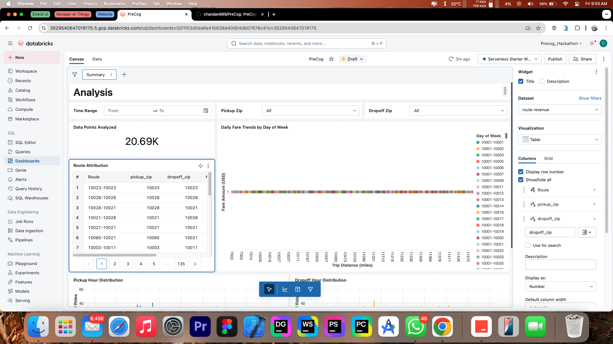

# PreCog AI (Saarthi) Readme

**Illuminating Paths to Social Harmony – A Game-Changing Hyperlocal Intelligence System**

PreCog AI, affectionately nicknamed *Saarthi* (सारथी – The Charioteer/Guide), is a revolutionary Hyperlocal Intelligence System engineered for proactive de-escalation, social cohesion, and community well-being. By shifting from reactive crisis management to data-informed foresight, PreCog AI empowers local authorities and community leaders with critical insights to anticipate, understand, and mitigate potential social friction before it escalates.

---

## Table of Contents

1. [The Profound Challenge](#the-profound-challenge)
2. [Our Solution](#our-solution)
3. [Key Features & Capabilities](#key-features--capabilities)
4. [Alternative Business Use Case](#alternative-business-use-case)
5. [Deploying and Scaling with Databricks](#deploying-and-scaling-with-databricks)
6. [Steps to Deploy on Databricks](#steps-to-deploy-on-databricks)
7. [Project Structure](#project-structure)
8. [Setup and Installation](#setup-and-installation)
9. [Configuration](#configuration)
10. [Running the Application](#running-the-application)
11. [Roadmap & Future Enhancements](#roadmap--future-enhancements)
12. [Contributing](#contributing)
13. [License](#license)

---

## The Profound Challenge

India's rich tapestry of cultures, languages, and communities is a source of immense strength—but also presents unique challenges:

* **Localized Friction**: Misunderstandings or resource competition can spark social tension.
* **Misinformation & Rumors**: Rapid spread via social media can erode trust.
* **Reactive Governance**: Authorities often respond after events occur instead of preventing escalation.
* **Information Overload**: Sifting through diverse data sources for actionable intelligence is daunting.

## Our Solution

PreCog AI offers a multi-faceted platform:

1. **Hyperlocal Sentiment & Misinformation Anomaly Detector**
2. **Friction Point Predictor**
3. **Intelligent Intervention Recommender**
4. **Community Pulse Dashboard (BI & Visualization)**

---

## Community Pulse Dashboard (BI & Visualization)

A dynamic, intuitive dashboard providing real-time views of anonymized sentiment hotspots, trending civic concerns, and AI-flagged friction areas. Authorized users can:

* Drill down into issue categories (never individual posts).
* Track interventions and measure impact.
* Allocate resources proactively based on probabilistic risk forecasts.

### Example Dashboard in Databricks SQL

Below is an example of how the PreCog Hyperlocal engine processes streams of data points and transmits them to a BI dashboard powered by Databricks SQL. Leaders and decision-makers can observe daily trends, route attributions, and pick-up/drop-off distributions to tailor on-ground actions swiftly.



> *Figure: PreCog AI Community Pulse Dashboard displayed in Databricks SQL*.

---

## Deploying and Scaling with Databricks

*PreCog AI* harnesses the **Databricks Lakehouse Platform** for robust, scalable analytics and AI workloads. Key components include:

* **Delta Lake**: Reliable, ACID transactional storage.
* **Spark NLP**: Scalable text analytics in multiple languages.
* **MLflow**: End-to-end ML lifecycle management.
* **Structured Streaming**: Real-time data processing.

Refer to the [Deploying on Databricks](#steps-to-deploy-on-databricks) section for a step-by-step guide.

---

## Steps to Deploy on Databricks

1. **Prerequisites**: Databricks workspace, CLI, Git.
2. **Code Packaging**: Create a Python wheel and install as a cluster library.
3. **Cluster Configuration**: Set up job and interactive clusters with required libraries.
4. **Data Ingestion & Delta Lake**: Use Auto Loader or Structured Streaming.
5. **Model Training & MLflow**: Log training runs, register models.
6. **Workflow Orchestration**: Use Databricks Workflows to schedule jobs.
7. **Dashboarding**: Build SQL dashboards or connect external Streamlit apps.
8. **Monitoring & Logging**: Leverage Databricks job logs and in-app logging.

---

## Project Structure

```
PreCog/
├── data/
├── notebooks/
├── scripts/
├── src/
│   ├── ai_models/
│   ├── bi_dashboard/
│   ├── data_ingestion/
│   ├── precog/
│   └── utils/
├── tests/
├── docs/
│   └── images/
└── README.md
```

---

## Setup and Installation

1. Clone the repo: `git clone <url>`
2. Create virtual environment.
3. Install dependencies: `pip install -r requirements.txt`
4. Download NLTK data.

---

## Configuration

Configure API keys, LLM preferences, data paths, and log levels via `src/precog/config/config.py` and environment variables.

---

## Running the Application

* **CLI**: `python -m src.precog.main [generate_synthetic_data|train|report_once|monitor]`
* **Dashboard**: `streamlit run src/bi_dashboard/app.py`

---

## Roadmap & Future Enhancements

* Enhanced vernacular NLP
* Advanced misinformation detection
* Causal inference modules
* Mobile interfaces
* Federated learning

---

## Contributing

We welcome contributions! See `CONTRIBUTING.md` for guidelines.

---

## License

This project is licensed under the MIT License.

---

**PreCog AI (Saarthi) – Building a Safer, More Cohesive Future, Together.**
